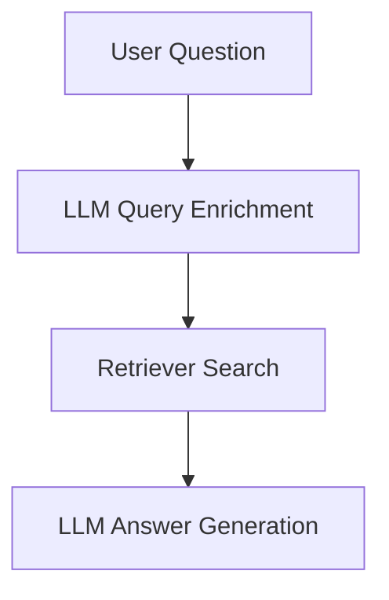
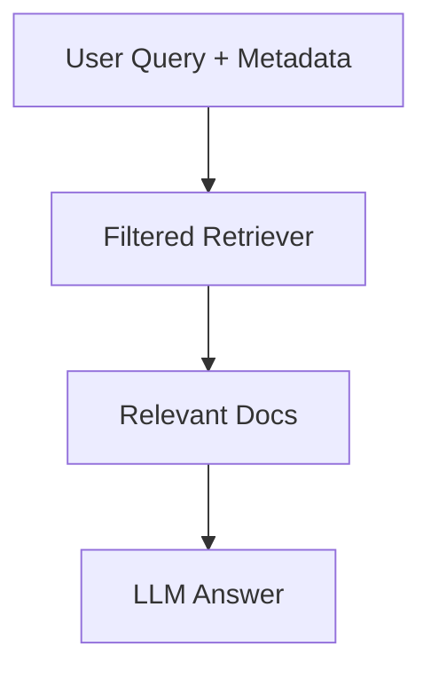
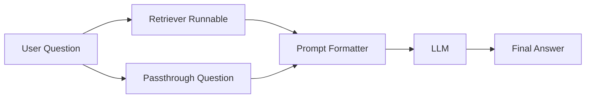

# 🧠 Query Builders Guide

Welcome to the **LangChain Query Builder** repository — your go-to resource to understand and implement different types of **query construction techniques** in **RAG-based LLM systems** using **LangChain**.

---

## 📌 What is a Query Builder?

In **RAG (Retrieval-Augmented Generation)** systems, a **Query Builder** transforms user questions into optimized search queries that retrieve the **most relevant documents** from the vector store.

> Think of it as a smart pre-processor that converts vague questions into effective search commands.

---

## 🧭 Why Do We Use Query Builders?

- **🔍 Improve Retrieval Quality** - Enhance the precision of document retrieval.
- **🧩 Add Context, Structure, or Metadata Filters** - Enrich queries with additional context or constraints.
- **🔁 Allow Chaining and Modular RAG Components** - Enable flexible, composable pipelines.
- **🧠 Make LLMs Reason Better** - Provide better-retrieved information for improved LLM outputs.

---

## 🔢 Types of Query Builders

### 1. 🧱 Static Builders

**What**: Use simple string templates (`f-strings`) to structure queries.

**Use When**:
- Queries are straightforward.
- No dynamic context or metadata needed.

**Example**:
```python
query = f"Question: {user_question} | Task: Retrieve matching content"
```

**Usage in LangChain**:
- Manually passed to retriever as query.
- No Runnable required.

### 2. ⚙️ Dynamic Builders

**What**: Use an LLM to enrich, rephrase, or clarify the user’s query before passing to retriever.

**Use When**:
- User queries are vague, complex, or context-dependent.
- You want LLMs to improve retrieval quality.

**Example**:
```python
from langchain_core.prompts import PromptTemplate
from langchain.chains import LLMChain

template = "Rewrite this user query to be better for search:\n\n{question}"
prompt = PromptTemplate.from_template(template)

llm_chain = LLMChain(llm=chat_model, prompt=prompt)
optimized_query = llm_chain.invoke({"question": user_question})
```

**How it Fits**:


### 3. 🧩 Metadata-Based Builders

**What**: Construct queries using structured filters like year, topic, author, etc.

**Use When**:
- You store metadata in vector DB (e.g., Chroma, Qdrant).
- Need filtered retrieval: "Get Python documents from year > 2022".

**Example**:
```python
retriever = vectorstore.as_retriever(
    search_kwargs={
        "filter": {
            "topic": "python",
            "year": {"$gt": 2022}
        },
        "k": 5
    }
)
```

**Note**: Not supported by FAISS — use Chroma or Qdrant instead.

**How it Fits**:


### 4. 🔗 Chainable Builders (Runnable-based)

**What**: Compose modular, reusable steps using LangChain’s Runnable system (`RunnableMap`, `RunnableLambda`, `RunnablePassthrough`).

**Use When**:
- You want a production-grade, composable RAG pipeline.
- Need to chain: retrieval → prompt formatting → LLM call → parsing.

**Example**:
```python
from langchain_core.runnables import RunnableLambda, RunnableMap

rag_chain = (
    RunnableMap({
        "context": lambda x: retriever.get_relevant_documents(x["question"]),
        "question": lambda x: x["question"]
    })
    | prompt_template
    | chat_model
)
```

**Flow Diagram**:


---

## ⚖️ When to Use Which Query Builder?

| **Type** | **Use Case Example** | **Tools Required** |
|----------|----------------------|--------------------|
| **Static** | FAQs, simple lookup | PromptTemplate |
| **Dynamic** | Vague queries, natural language rephrasing | LLMChain + Prompt |
| **Metadata-Based** | Filtered doc search (by year, topic, source) | Chroma/Qdrant + filter |
| **Chainable** | Modular, production-ready RAG pipelines | LangChain Runnables |

---

## 🧠 Best Practices

- **✅ Use Static for Speed**: Ideal for simple, predictable queries where performance is critical.
- **🔁 Use Dynamic for Poor Query Quality**: Leverage LLMs to rephrase vague or ambiguous queries.
- **🧩 Use Metadata with Metadata-Aware Stores**: Ensure your vector store supports metadata filtering (e.g., Chroma, Qdrant).
- **🔗 Use Chainable for Scalable Pipelines**: Build modular, production-ready RAG systems with Runnables.

---

## 📂 Repository Structure

```
query-builders/
│
├── Chainable Query Builders.ipynb
├── Static Query Builder.ipynb
├── Dynamic Query Builders.ipynb
├── Metadata-based Query Builders.ipynb
├── sample_docs/
│   └── solid-python.pdf
└── readme.markdown
```

---

## 🚀 Realistic LangChain Usage

Query Builders are integral to building robust RAG pipelines in LangChain. Here’s a realistic example of how they integrate into a full pipeline:

```python
from langchain_core.prompts import PromptTemplate
from langchain_core.runnables import RunnableMap, RunnablePassthrough
from langchain_community.vectorstores import Chroma
from langchain_openai import ChatOpenAI, OpenAIEmbeddings

# Initialize components
vectorstore = Chroma(embedding_function=OpenAIEmbeddings())
retriever = vectorstore.as_retriever(search_kwargs={"k": 5})
llm = ChatOpenAI(model="gpt-4")

# Dynamic query builder with metadata filter
prompt_template = PromptTemplate.from_template(
    "Based on {context}, answer the question: {question}"
)

# Chainable RAG pipeline
rag_chain = (
    RunnableMap({
        "context": lambda x: retriever.get_relevant_documents(
            x["question"],
            filter={"topic": "python", "year": {"$gt": 2022}}
        ),
        "question": RunnablePassthrough()
    })
    | prompt_template
    | llm
)

# Execute
result = rag_chain.invoke({"question": "What are Python best practices?"})
print(result.content)
```

This pipeline:
1. Uses a **Metadata-Based Query Builder** to filter Python documents from after 2022.
2. Employs a **Chainable Builder** with Runnables to combine retrieval, prompt formatting, and LLM execution.
3. Produces a coherent answer using retrieved context.

---

## 🔄 Upcoming Features

| **Category** | **Components** | **ETA** |
|--------------|----------------|---------|
| **🧪 Evaluation Metrics** | Retrieval quality metrics (Precision@10, Recall@10, F1) | Q3 2025 |
| **🛠️ LangGraph Integration** | QueryBuilder workflows with LangGraph | Q4 2025 |
| **🎯 Model Integration** | Support for OpenAI, Claude, Groq, Mistral | Q4 2025 |

---

## 🤝 Contributors & Help

If you'd like help building or modifying a custom query pipeline, feel free to raise an issue or start a discussion on GitHub!

- **📖 Documentation**: Check individual notebook READMEs.
- **💬 Discussions**: Use GitHub Discussions for questions.
- **🐛 Issues**: Report bugs via GitHub Issues.
- **📧 Contact**: Open an issue for direct communication.

---

## 📜 License

This project is licensed under the **MIT License** - see the [LICENSE](LICENSE) file for details.

---

<div align="center">

**⚡ Ready to master Query Builders in LangChain? Start with any notebook and build your RAG expertise step by step! ⚡**

*Built with ❤️ using LangChain and Python*

</div>